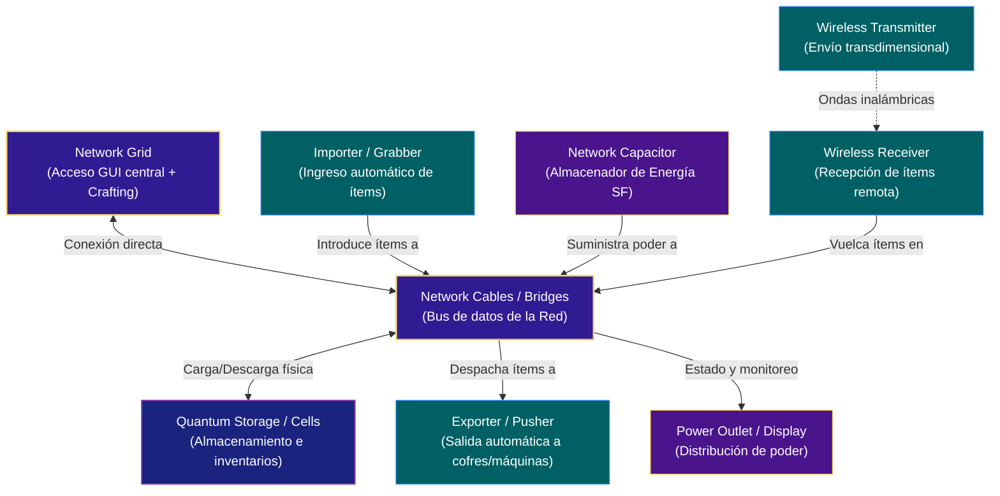

<p align="center">
  
</p>

<h1 align="center">NetworksV6-Drake</h1>

<p align="center">
  <a href="https://github.com/DrakesCraft-Labs/NetworksV6-drake/actions/workflows/drake-ci.yml"></a>
  <a href="https://github.com/DrakesCraft-Labs/NetworksV6-drake/releases"></a>
  <a href="https://github.com/DrakesCraft-Labs/NetworksV6-drake/tree/main"></a>
  <a href="LICENSE"></a>
  
  
  
</p>

**Networks** es un addon de Slimefun que aporta una red de almacenamiento y movimiento de ítems potente y sencilla, pensada para convivir con **Cargo** y el resto de tu automatización.

Este repositorio es el **port estable de DrakesCraft-Labs**: parte del árbol **Networks-Experimental (Netex)** y de los parches de producción del monorepo Drake, adaptado a **Paper / Purpur 1.21.11**, **Java 21** y el stack **Slimefun 4 Drake**.

### 📡 Topología y Conectividad de la Red



---

## Descarga

| Origen | Enlace |
|--------|--------|
| **Releases (recomendado)** | [Releases de NetworksV6-drake](https://github.com/DrakesCraft-Labs/NetworksV6-drake/releases) — JAR `NetworksV6-Drake-v*.jar` |
| **CI (último build main)** | Artefacto `NetworksV6-Drake-SNAPSHOT` en [Actions → Drake CI](https://github.com/DrakesCraft-Labs/NetworksV6-drake/actions/workflows/drake-ci.yml) |
| **Build local** | `target/NetworksV6-Drake-v11-SNAPSHOT.jar` tras `mvn test package` |

### Publicar una release

1. Asegura que `main` pasa **Drake CI** (tests + build).
2. Crea y empuja un tag semver: `git tag v11.0.0-drake.1 && git push origin v11.0.0-drake.1`
3. El workflow **Drake Release** publica el JAR en GitHub Releases.

También puedes lanzarlo manualmente: **Actions → Drake Release → Run workflow** (indica el tag).

> No hay autoupdate remoto (sin BlobBuild ni actualizador Drake Labs). Instala el JAR que elijas desde Releases o tu propio build.

---

## Sobre Networks

La guía completa del diseño original (ítems, bloques, mecánicas) sigue en la documentación de **Sefiraat**:

- [Documentación oficial de Networks](https://sefiraat.dev)
- Repositorio upstream: [Sefiraat/Networks](https://github.com/Sefiraat/Networks)

Imágenes de referencia del wiki original:

| Setup | Grid | Crafting grid |
|-------|------|----------------|
|  |  |  |

### Network Grid / Crafting Grid

Accede a todos los ítems de la red en una sola GUI: retira de a uno o por stack, inserta directamente y usa el **crafting grid** para recetas vanilla y Slimefun con ingredientes tomados de la red.

### Network Bridge

Bloque económico para extender la red.

### Network Cells

Un bloque con capacidad de cofre doble; expone ítems a la red (pocos ítems, no apilables o únicos).

### Network Quantum Storage

Almacenamiento masivo de **un solo tipo** de ítem (desde miles hasta miles de millones según mejora). Ideal como “barril profundo” de producción en masa.

### Network Monitors

Exponen inventarios de bloques conectados (p. ej. tarjetas de Network Shell o barriles de otros addons).

### Import / Export

- **Importer**: 9 ranuras; Cargo puede depositar; la red absorbe cuando hay capacidad.
- **Exporter**: plantilla de un ítem; extrae coincidencias de la red hacia su inventario (accesible por Cargo).

### Push y Pull

- **Grabber**: extrae de máquinas Slimefun adyacentes compatibles con cargo-out.
- **Pusher**: plantilla + empuje a ranuras de entrada de máquinas vecinas.
- **Vanilla Grabber / Pusher**: variantes para inventarios vanilla (hornos, etc.).

### Energía

**Capacitor** almacena energía del EnergyNet para máquinas de la red. **Power Display** muestra el total. **Power Outlet** devuelve energía a máquinas EnergyNet adyacentes.

### Wireless

**Transmitter** envía ítems coincidentes a un **Receiver** enlazado, que intenta meterlos en su propia red.

### Autocrafting

- **Encoder**: codifica recetas vanilla/Slimefun en blueprints.
- **Autocrafter**: fabrica con ítems y energía de la red; salida a la red.
- **Withholding Autocrafter**: mantiene hasta un stack interno expuesto a la red.

### Control remoto

**Remotes** enlazados a un grid (alcance por tier: 150, 500, ilimitado, cross-dimension).

### Otros

**Purger** (basura con plantilla), **Crayon** (partículas), **Configurator** (copiar/pegar ajustes de nodos), **Probe** (resumen de la red).

---

## Qué cambia NetworksV6-Drake (modificaciones Drake)

Resumen de lo que **este fork añade o altera** respecto al upstream y a builds intermedias. Detalle técnico de dupes: [`docs/INVENTORY_AND_DUPES.md`](docs/INVENTORY_AND_DUPES.md). Auditoría web/upstream (issues #229–#240, Fluffy #163): [`docs/UPSTREAM_INCIDENTS_AUDIT.md`](docs/UPSTREAM_INCIDENTS_AUDIT.md).

### Stack y empaquetado

| Tema | Drake |
|------|--------|
| Repositorio | Standalone; ya no vive en `drakes-slimefun-labs` |
| Rama activa | **`main`** (`1.21-latin` obsoleta) |
| Minecraft objetivo | **1.21.11** (smoke en Paper/Purpur 1.21.x) |
| API / build | Paper **1.21.1** API, **Java 21** |
| Slimefun | `com.github.drakescraft_labs` **11.0-Drake** |
| Dough | `dev.drake.dough` (no el paquete shaded legacy en addons) |
| Persistencia NBT | `dev.drake.sefilib.persistence` |
| Artefacto | `NetworksV6-Drake-v11-SNAPSHOT.jar` |
| Autoupdate | **Desactivado** (sin `DrakesLabsReleaseUpdate` / BlobBuild) |

### Base de código fusionada

- Núcleo **Sefiraat/Networks** (GPL-3.0).
- Mejoras **Networks-Experimental (Netex)** — utilidades `com.balugaq.netex`, cachés de acceso, greedy blocks, etc.
- Parches de producción **Chagui68** / monorepo Drake (shutdown, recetas, compatibilidad foundry).
- Ajustes de imports y API al fork **Slimefun 4 Drake** y **dough-core** Drake.

### Estabilidad, inventarios y anti-dupe

| Área | Cambio Drake |
|------|----------------|
| Apagado servidor | `Networks.onDisable()` + `markDirty()` masivo en inventarios NTW |
| Grafo al desmontar | `NetworkStorage.removeNode` → `unregisterNode` saca la coordenada de `cells`, `monitors`, etc. (#229) |
| Bloque ajeno en nodo NTW | `NetworkIntegrity.onForeignBlockOccupied` al colocar (p. ej. **Fluffy Barrel** sobre celda rota) (#230) |
| Integridad de red | `NetworkIntegrity` — valida bloques NTW, `pruneStaleLocations`, purga fantasmas |
| Celdas / retiros | `getCellMenus()` solo menús `NetworkCell` reales; slots de celda correctos; caché de barriles invalidada |
| Explosivos / wither / dripleaf | `ExplosiveToolListener` protege **todas** las máquinas NTW; limpia grafo |
| Estructuras (árboles) | `SyncListener` — `StructureGrow`, `EntityChangeBlock`, `BlockFromTo` |
| Grid GUI | `GridDupeGuardListener` — middle/double/hotbar/clone/drop-all; retiros solo con lore `Amount:` del display |
| Grid inventario | `refreshRootItems()` al pintar; agregación con `NetworkStackAggregator` (#226) |
| Quantum + grid | `markDirty` + `syncBlock` en retiros sin abrir menú (#208) |
| Grabber Slimefun | `NetworkTransportUtils` — solo cuenta ítems realmente absorbidos; no extrae de menús `NTW_*` (#240) |
| Pusher | Solo empuja a inventarios externos (`isExternalInventory`) |
| Import / grid input / Wireless RX | Mismo transporte seguro + `markDirty` |
| Vanilla grabber | Inyección directa + flush slot OUTPUT (#235); `BlockStateRefreshListener` |
| Greedy (Netex) | `addItemStack0` no abandona el flujo si el greedy no vació el stack |
| Pociones / meta rara | `StackUtils` null-safe (#223) |
| Rake | `clearNetwork()` antes de vaciar el bloque (#106) |
| Concurrencia | `ConcurrentHashMap` en estructuras críticas de `NetworkRoot` |

**Smoke en servidor (DrakesCraft):** romper celda indirectamente → colocar barrel en la misma posición → abrir grid: no debe extraer del barrel ni duplicar con middle/double. Lista completa en [`docs/INVENTORY_AND_DUPES.md`](docs/INVENTORY_AND_DUPES.md#smoke-test-en-servidor).

### Compatibilidad temporal (1.21.11)

- **NetworkControlX** y **NetworkControlV**: modo compat sin puente NMS completo (evita dupes conocidos con shulker/cutter; funcionalidad de corte limitada hasta NMS dedicado).
- Integraciones opcionales (**HUD**, **Netheopoiesis**, etc.) desacopladas para no tumbar el arranque si faltan dependencias.

### Carpeta `experimental/`

Copia auditada de **NetworksExperimental-Drake** (Netex puro). **No** es el JAR de producción; sirve de referencia y pruebas.

### CI y releases

- **Drake CI** en `main`: compilación Maven real (standalone).
- **Drake Release**: tag `v*` → artefacto en GitHub Releases si el build pasa.

---

## Compatibilidad

| Componente | Versión |
|------------|---------|
| Minecraft | **1.21.11** (compatible 1.21.x) |
| Servidor | Paper / Purpur recomendado |
| Java | **21** |
| Slimefun | Drake **11-SNAPSHOT** (foundry) |
| Cargo | Recomendado (diseño original) |

Dependencias opcionales del upstream pueden seguir funcionando si están en tu servidor; las integraciones Drake deshabilitadas no bloquean el load.

---

## Instalación

1. Descarga el `.jar` desde [Releases](https://github.com/DrakesCraft-Labs/NetworksV6-drake/releases) o compílalo localmente.
2. Colócalo en `plugins/` junto a **Slimefun 4 Drake** y dependencias del foundry.
3. Reinicia el servidor.
4. En consola debe aparecer el banner **NetworksV6 Drake** y el plugin `NetworksV6-Drake`.

---

## Build local

Las dependencias Drake deben estar en Maven local (desde el monorepo foundry):

```bash
cd ../drakes-slimefun-labs
mvn -B -ntp -DskipTests install -pl sources/dough-core,sources/slimefun-core/Slimefun4-src,sources/batch-2-expansion/SefiLib,sources/repos-to-port/InfinityExpansion -am
```

En este repositorio:

```bash
git clone https://github.com/DrakesCraft-Labs/NetworksV6-drake.git
cd NetworksV6-drake
git checkout main
mvn -B -ntp -DskipTests clean package
```

Salida: `target/NetworksV6-Drake-v11-SNAPSHOT.jar`

---

## Documentación adicional

| Documento | Contenido |
|-----------|-----------|
| [`docs/INVENTORY_AND_DUPES.md`](docs/INVENTORY_AND_DUPES.md) | Vectores de dupe, mitigaciones Drake y smoke tests |
| [`docs/UPSTREAM_INCIDENTS_AUDIT.md`](docs/UPSTREAM_INCIDENTS_AUDIT.md) | Auditoría de issues upstream (#229–#240, Fluffy, SF) y estado |
| [`docs/CI_AND_RELEASE.md`](docs/CI_AND_RELEASE.md) | Workflows Drake CI / Release y tags |
| [`CONTRIBUTING.md`](CONTRIBUTING.md) | Cómo contribuir y CI |
| [`experimental/README.md`](experimental/README.md) | Módulo experimental (no producción) |

**Reportar bugs:** [Issues](https://github.com/DrakesCraft-Labs/NetworksV6-drake/issues)

---

## Créditos y linaje

Este proyecto **no existiría** sin el trabajo de la comunidad Slimefun y los forks previos. **NetworksV6-Drake** es una obra derivada bajo **GPL-3.0**; el código original y sus extensiones conservan los derechos de sus autores.

### Autor original

- **[Sefiraat](https://github.com/Sefiraat)** — creador de **Networks** y documentación en [sefiraat.dev](https://sefiraat.dev).  
  Repositorio: [github.com/Sefiraat/Networks](https://github.com/Sefiraat/Networks)

### Agradecimientos del README original (Sefiraat)

- **Boomer**, **Cai** y **Lucky** — pruebas y refinamiento de Networks.  
- Comunidad de **mct.tantrum.org** — setups de estrés y feedback.  
- **GentlemanCheesy** / **mc.talosmp.net** — patrocinio y apoyo temprano.

### Forks y contribuciones en la cadena hacia Drake

| Persona / equipo | Aporte |
|------------------|--------|
| **[Chagui68](https://github.com/Chagui68)** | Parches de producción, estabilidad en servidor real, fixes de inventario |
| **[mmmjjkx](https://github.com/mmmjjkx)** | **Networks-Experimental (Netex)** — cachés, greedy, utilidades `balugaq.netex` |
| **balugaq (Netex)** | Capa experimental integrada en la base de este port |
| **[DrakesCraft-Labs](https://github.com/DrakesCraft-Labs)** | Port standalone, adaptación **1.21.11**, stack Slimefun Drake, anti-dupe, CI, mantenimiento |

### Mantenimiento actual

- Organización: **[DrakesCraft-Labs](https://github.com/DrakesCraft-Labs)**  
- Servidor de referencia: **[DrakesCraft](https://drakescraft.cl)**  
- Rama de desarrollo: **`main`**

Si usas este fork en público, conserva esta sección de créditos y cumple la **GPL-3.0** (incluido ofrecer fuente de tus modificaciones).

---

## Licencia

Copyright (C) los autores originales y contribuyentes de cada fork en la cadena.

Distribuido bajo **GNU General Public License v3.0**. Ver [`LICENSE`](LICENSE).

El código fuente de Sefiraat/Networks y obras derivadas (Chagui, Netex, Drake) permanece bajo los términos de la GPL; este repositorio añade cambios de DrakesCraft-Labs publicados en el mismo espíritu copyleft.
